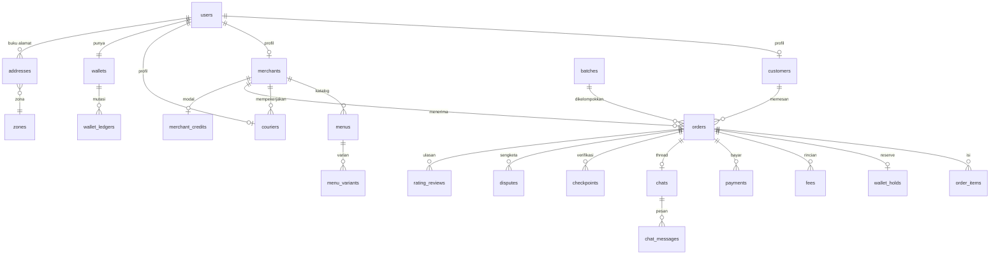

# ERD Final — Irbid MVP

Status: **draft untuk ditinjau** (M1). Milestone: `docs/backend/MILESTONES.md` → M1.
Tanggal: 2026-10-09.

Sumber: `za7tein-pwa/docs/product/schema-draft-v1.md` (17 entitas), `docs/design/flows/INDEX.json`
(24 flow, peta `event → entity`), `docs/product/prd/decision-irbid-mvp.md`, dan `supabase/schema.sql`
(kondisi repo ini).

> **Aturan yang mengikat:** `UNRESOLVED` tidak ditebak. Setiap kolom yang bergantung keputusan PO
> ditandai `-- UNRESOLVED: <id>` di DDL dan dihitung di §7. Nama tabel memakai **plural snake_case**;
> padanannya ke nama entitas draft dicatat di §1.

## 1. Konvensi

| Topik | Aturan |
|---|---|
| Primary key | `bigint generated always as identity primary key` (draft: `number/pk`) |
| Foreign key | `<nama_tabel_tunggal>_id`, selalu `references` eksplisit + `on delete` sadar |
| Uang | JOD = `numeric(12,3)` (1 JOD = 1000 piastre), sufiks `_jod`. IDR = `numeric(18,2)`, sufiks `_idr` |
| Waktu | `timestamptz` untuk semua kolom waktu; durasi/timer dalam `integer` detik |
| Enum | `text` + `check (col in (...))` — bukan tipe enum Postgres, supaya penambahan nilai murah |
| Snapshot | Kolom yang di-*freeze* saat order dibuat ditandai `-- snapshot` |
| Uang & ledger | `wallet_ledgers` **append-only** (tanpa update/delete) |
| Belum diputuskan | ditandai `-- UNRESOLVED: <id>` |

**Peta nama: draft → tabel**

| Draft | Tabel | Catatan |
|---|---|---|
| `user` | `users` | |
| `address` | `addresses` | |
| `customer` | `customers` | |
| `merchant` | `merchants` | |
| `courier` | `couriers` | |
| `favMerchant` | `fav_merchants` | |
| `menu` / `menuVariant` | `menus` / `menu_variants` | |
| `order` / `orderItem` | `orders` / `order_items` | |
| `batch` | `batches` | |
| `wallet` / `ledger` | `wallets` / `wallet_ledgers` | |
| `chat` / `chatMessage` | `chats` / `chat_messages` | |
| `incidentResolution` | `disputes` | ⚠️ nama bentrok dengan flows — lihat §8 |
| `marketing` / `ratingReview` | `marketing` / `rating_reviews` | |
| — (hanya di flows) | `fees`, `taxes`, `payments`, `deposits`, `protection_fund`, `merchant_credits`, `cashback_tiers`, `exchange_rates`, `push_subscriptions`, `roles`, `operators`, `audit_logs`, `tax_reports`, `platform_profit`, `platform_switches`, `phone_verifications`, `checkpoints`, `wallet_holds`, `topups`, `cashouts`, `review_replies`, `zones` | |

## 2. Ringkasan tabel (42)

| Fase | Tabel |
|---|---|
| **M2** — identitas & katalog (10) | `users`, `phone_verifications`, `customers`, `addresses`, `zones`, `merchants`, `couriers`, `fav_merchants`, `menus`, `menu_variants` |
| **M3** — order & uang (18) | `orders`, `order_items`, `batches`, `fees`, `taxes`, `payments`, `wallets`, `wallet_holds`, `wallet_ledgers`, `topups`, `cashouts`, `deposits`, `merchant_credits`, `cashback_tiers`, `disputes`, `dispute_appeals`, `protection_fund`, `exchange_rates` |
| **M4** — ops & platform (14) | `chats`, `chat_participants`, `chat_messages`, `checkpoints`, `rating_reviews`, `review_replies`, `marketing`, `push_subscriptions`, `roles`, `operators`, `audit_logs`, `tax_reports`, `platform_profit`, `platform_switches` |

## 3. DDL — Fase 1 (M2): identitas & katalog

```sql
-- users: identitas login. Peran menentukan tabel profil mana yang dipakai.
create table users (
  id          bigint generated always as identity primary key,
  auth_user_id uuid unique references auth.users(id) on delete set null,  -- jembatan ke Supabase Auth (pengganti profiles.id)
  role        text not null check (role in ('customer','merchant','courier','cs','superadmin')),
  email       text unique,
  phone       text not null unique
              check (phone ~ '^\+[1-9][0-9]{7,14}$'),  -- E.164 (+962/+62); wajib
  verified    boolean not null default false,
  status      text not null default 'active' check (status in ('active','suspended')),
  auth_provider text not null default 'phone' check (auth_provider in ('phone','google')),
  created_at  timestamptz not null default now()
);

-- phone_verifications: Level 1 = validasi format saja (tanpa OTP WA)
create table phone_verifications (
  id         bigint generated always as identity primary key,
  user_id    bigint references users(id) on delete cascade,
  phone      text not null check (phone ~ '^\+[1-9][0-9]{7,14}$'),
  method     text not null default 'format_only' check (method in ('format_only','wa_otp')),
  code       text,                  -- UNRESOLVED: AUT-1 (dipakai hanya bila Level 2 aktif)
  expires_at timestamptz,
  verified_at timestamptz,
  created_at timestamptz not null default now()
);

-- customers: profil customer
create table customers (
  id         bigint generated always as identity primary key,
  user_id    bigint not null unique references users(id) on delete cascade,
  name       text not null,
  risk_flag  boolean not null default false,   -- blacklist COD (ditandai CS/SA)
  created_at timestamptz not null default now()
);

-- zones: master zona. Didefinisikan Super Admin; merchant hanya mengaktifkan.
create table zones (
  id         bigint generated always as identity primary key,
  code       text not null unique,            -- 'Hijazi', 'Syimali', ...
  name       text not null,
  polygon    jsonb,                           -- array [[lat,lng], ...]
  created_at timestamptz not null default now()
);

-- addresses: buku alamat + zona hasil hitung saat pin disimpan
create table addresses (
  id          bigint generated always as identity primary key,
  user_id     bigint not null references users(id) on delete cascade,
  label       text not null,
  address     text not null,
  latitude    double precision not null,
  longitude   double precision not null,
  is_default  boolean not null default false,
  zone_id     bigint references zones(id),     -- UNRESOLVED: ZON-1 (aturan & ambang hitung)
  zone_code   text,                            -- denormalisasi kode zona saat disimpan
  created_at  timestamptz not null default now()
);

-- merchants: toko. tenantStatus + deposit = kontrol platform.
create table merchants (
  id            bigint generated always as identity primary key,
  user_id       bigint not null unique references users(id) on delete restrict,
  store_name    text not null,
  store_phone   text check (store_phone ~ '^\+[1-9][0-9]{7,14}$'),
  store_address text,
  latitude      double precision,      -- lokasi toko: dipakai hitung zona (haversine) & fee radius
  longitude     double precision,      -- (draft §2: zone dihitung "haversine ke merchant"; f20 gate coverage)
  description   text,
  photo         text,
  available     boolean not null default true,          -- buka/tutup (pengganti `settings.store_status`)
  delivery_config jsonb not null default '{}'::jsonb,   -- { mode, radiusMeters, feeByDistance[], feeByArea[], activeZones[] }
  tenant_status text not null default 'pending'
                check (tenant_status in ('pending','approved','suspended','blacklisted')),
  deposit_jod   numeric(12,3) not null default 0,       -- UNRESOLVED: FEE-1 (PO: 3.50)
  deposit_status text not null default 'unpaid'
                check (deposit_status in ('unpaid','held','released')),
  created_at    timestamptz not null default now()
);

-- couriers: kurir adalah karyawan merchant (maks 3 — ditegakkan di API, bukan FK)
create table couriers (
  id           bigint generated always as identity primary key,
  user_id      bigint not null unique references users(id) on delete cascade,
  merchant_id  bigint not null references merchants(id) on delete restrict,
  name         text not null,                  -- tambahan: nama tampilan kurir (draft tidak mencantumkannya;
                                               -- sejajar dengan customers.name; UI & chat menampilkannya)
  availability text not null default 'unavailable'
               check (availability in ('available','unavailable','busy')),
  latitude     double precision,
  longitude    double precision,
  last_seen_at timestamptz,                    -- tambahan: heartbeat tawaran (bukan di draft)
  photo        text,
  vehicle      text,
  created_at   timestamptz not null default now()
);

-- fav_merchants
create table fav_merchants (
  id          bigint generated always as identity primary key,
  user_id     bigint not null references users(id) on delete cascade,
  merchant_id bigint not null references merchants(id) on delete cascade,
  created_at  timestamptz not null default now(),
  unique (user_id, merchant_id)
);

-- menus
create table menus (
  id          bigint generated always as identity primary key,
  merchant_id bigint not null references merchants(id) on delete cascade,
  name        text not null,
  description text,
  price_jod   numeric(12,3) not null default 0,
  available   boolean not null default true,
  image       text,
  -- Kolom legacy yang TIDAK ada di draft → lihat §8 (butuh keputusan, jangan diisi tebakan)
  stock       integer,
  category    text,
  created_at  timestamptz not null default now()
);

-- menu_variants: 1 = radio (ukuran), N = checkbox (topping)
create table menu_variants (
  id         bigint generated always as identity primary key,
  menu_id    bigint not null references menus(id) on delete cascade,
  name       text not null,
  required   boolean not null default false,
  max_select integer not null default 1 check (max_select >= 1),
  options    jsonb not null default '[]'::jsonb,   -- [{ id, name, priceDeltaJod }]
  created_at timestamptz not null default now()
);
```

## 4. DDL — Fase 2 (M3): order & uang

```sql
-- orders: semua nominal = SNAPSHOT saat order dibuat
create table orders (
  id                bigint generated always as identity primary key,
  code              text not null unique,        -- SA-1041 (tidak ada di draft; dari flows/FEAT-2014)
  status            text not null default 'cart'
                    check (status in ('cart','quotation','canceled','prepare','waitingCourier',
                                      'waitingDelivery','delivery','done')),  -- UNRESOLVED: OST-1
  customer_id       bigint not null references customers(id) on delete restrict,
  merchant_id       bigint not null references merchants(id) on delete restrict,
  delivery_address_id bigint not null references addresses(id) on delete restrict,
  batch_id          bigint,                      -- FK ditambahkan setelah `batches` ada
  courier_id        bigint references couriers(id) on delete set null,
  -- uang (JOD display, IDR settlement)
  sub_total_jod     numeric(12,3) not null,      -- snapshot
  delivery_fee_jod  numeric(12,3) not null,      -- snapshot
  platform_fee_jod  numeric(12,3) not null,      -- snapshot -- UNRESOLVED: FEE-1
  tip_jod           numeric(12,3) not null default 0,   -- snapshot
  promo_amount_jod  numeric(12,3) not null default 0,   -- snapshot
  total_jod         numeric(12,3) not null,      -- snapshot
  total_idr         numeric(18,2),               -- settlement
  zone_id           bigint references zones(id), -- snapshot (dipakai hitung fee)
  zone_code         text,                        -- snapshot
  promo_id          bigint,                      -- FK ke marketing
  -- pembayaran
  payment_method    text not null check (payment_method in ('cod','transfer','xendit_va','xendit_qris')),
  payment_status    text not null default 'unpaid'
                    check (payment_status in ('unpaid','pending','paid','failed','refunded')),
  paid_at           timestamptz,
  -- reserve/hold
  hold_status       text not null default 'none'
                    check (hold_status in ('none','reserved','settled','released')),
  -- waktu
  created_at        timestamptz not null default now(),
  placed_at         timestamptz,
  -- pembatalan
  cancel_reason     text,
  cancel_by         text check (cancel_by in ('customer','merchant','system')),
  order_note        text
);
create index on orders (merchant_id, status);
create index on orders (customer_id, created_at desc);
create index on orders (courier_id, status);

-- order_items: unit_price & modifiers = SNAPSHOT
create table order_items (
  id             bigint generated always as identity primary key,
  order_id       bigint not null references orders(id) on delete cascade,
  menu_id        bigint not null references menus(id) on delete restrict,
  name           text not null,                  -- snapshot nama hidangan
  qty            integer not null check (qty > 0),
  unit_price_jod numeric(12,3) not null,         -- snapshot
  modifiers      jsonb not null default '[]'::jsonb,  -- snapshot [{ variantId, optionId, name, priceDeltaJod }]
  line_total_jod numeric(12,3) not null,         -- snapshot (unitPrice + Σ delta) × qty
  note           text
);

-- batches: pengelompokan order untuk satu kurir + timer SLA
create table batches (
  id                    bigint generated always as identity primary key,
  merchant_id           bigint not null references merchants(id) on delete restrict,
  courier_id            bigint references couriers(id) on delete set null,
  status                text not null default 'prepare'
                        check (status in ('prepare','closed','waitingCourier','waitingDelivery','delivery')),
  eta_prepare_seconds   integer,
  eta_delivery_seconds  integer,
  sla_prepare_deadline  timestamptz,   -- UNRESOLVED: SLA-1
  sla_delivery_deadline timestamptz,   -- UNRESOLVED: SLA-1
  escalated_to_admin    boolean not null default false,
  created_at            timestamptz not null default now()
);
alter table orders add constraint orders_batch_fk
  foreign key (batch_id) references batches(id) on delete set null;

-- fees: rincian fee per order
create table fees (
  id         bigint generated always as identity primary key,
  order_id   bigint not null references orders(id) on delete cascade,
  kind       text not null check (kind in ('platform_merchant','platform_customer','delivery','service')),
  amount_jod numeric(12,3) not null,
  rule_ref   text,
  created_at timestamptz not null default now()
);

-- taxes: pajak dua lapis (GST makanan + pajak fee platform)
create table taxes (
  id         bigint generated always as identity primary key,
  order_id   bigint not null references orders(id) on delete cascade,
  kind       text not null check (kind in ('gst_food','platform_income')),
  rate_pct   numeric(6,3),             -- UNRESOLVED: TAX-1
  base_jod   numeric(12,3) not null,
  amount_jod numeric(12,3),            -- UNRESOLVED: TAX-1
  created_at timestamptz not null default now()
);

-- payments: jejak pembayaran per order
create table payments (
  id          bigint generated always as identity primary key,
  order_id    bigint not null references orders(id) on delete cascade,
  provider    text not null default 'none' check (provider in ('xendit','none')),
  method      text not null check (method in ('cod','transfer','xendit_va','xendit_qris')),
  amount_jod  numeric(12,3) not null,
  amount_idr  numeric(18,2),
  external_id text,                    -- id transaksi di Xendit
  status      text not null default 'unpaid'
              check (status in ('unpaid','pending','paid','failed','refunded')),
  paid_at     timestamptz,
  created_at  timestamptz not null default now(),
  unique (order_id, provider, external_id)
);

-- wallets
create table wallets (
  id                    bigint generated always as identity primary key,
  user_id               bigint not null unique references users(id) on delete cascade,
  balance_jod           numeric(12,3) not null default 0,
  reserved_balance_jod  numeric(12,3) not null default 0,
  updated_at            timestamptz not null default now(),
  check (balance_jod >= 0),
  check (reserved_balance_jod >= 0)
);

-- wallet_holds: reserve saat order dibuat → settle/release saat selesai/batal
create table wallet_holds (
  id         bigint generated always as identity primary key,
  wallet_id  bigint not null references wallets(id) on delete cascade,
  order_id   bigint not null references orders(id) on delete cascade,
  amount_jod numeric(12,3) not null,
  status     text not null default 'none'
             check (status in ('none','reserved','settled','released')),  -- tahap `cut` DIHAPUS
  expires_at timestamptz,              -- UNRESOLVED: RSV-1
  created_at timestamptz not null default now(),
  settled_at timestamptz,
  unique (order_id)
);

-- wallet_ledgers: APPEND-ONLY, double-entry
create table wallet_ledgers (
  id         bigint generated always as identity primary key,
  user_id    bigint not null references users(id) on delete restrict,
  type       text not null check (type in ('cr','db')),
  reference  text not null
             check (reference in ('topUp','order','delivery','withdrawal','refund','hold','release')),
  amount_jod numeric(12,3) not null,
  order_id   bigint references orders(id) on delete set null,
  created_at timestamptz not null default now()
);
create index on wallet_ledgers (user_id, created_at desc);

-- topups
create table topups (
  id               bigint generated always as identity primary key,
  wallet_id        bigint not null references wallets(id) on delete cascade,
  amount_jod       numeric(12,3) not null check (amount_jod > 0),
  amount_idr       numeric(18,2),
  rate_id          bigint,             -- FK ke exchange_rates
  method           text not null check (method in ('xendit_va','xendit_qris','transfer')),
  status           text not null default 'pending'
                   check (status in ('pending','paid','expired','failed')),
  instructions     jsonb,
  external_id      text,
  expires_at       timestamptz,        -- UNRESOLVED: WEB-1
  created_at       timestamptz not null default now()
);

-- cashouts
create table cashouts (
  id          bigint generated always as identity primary key,
  wallet_id   bigint not null references wallets(id) on delete cascade,
  amount_jod  numeric(12,3) not null check (amount_jod > 0),
  fee_jod     numeric(12,3),           -- UNRESOLVED: CO-1
  status      text not null default 'requested'
              check (status in ('requested','processing','paid','rejected')),
  destination text,
  created_at  timestamptz not null default now()
);

-- deposits: deposit COD + kredit founding
create table deposits (
  id          bigint generated always as identity primary key,
  merchant_id bigint not null references merchants(id) on delete cascade,
  kind        text not null check (kind in ('cod','founding_credit')),
  amount_jod  numeric(12,3) not null,  -- UNRESOLVED: FEE-1
  status      text not null default 'unpaid' check (status in ('unpaid','held','released')),
  verified_by bigint references users(id) on delete set null,
  verified_at timestamptz,
  created_at  timestamptz not null default now()
);

-- merchant_credits: modal + cashback. NON-WITHDRAWAL.
create table merchant_credits (
  id                 bigint generated always as identity primary key,
  merchant_id        bigint not null unique references merchants(id) on delete cascade,
  balance_jod        numeric(12,3) not null default 0,
  rebate_tier        text,             -- UNRESOLVED: INC-1
  rebate_period      text,
  rebate_amount_jod  numeric(12,3),
  rebate_paid_at     timestamptz,
  non_withdrawable   boolean not null default true,
  updated_at         timestamptz not null default now()
);

-- cashback_tiers
create table cashback_tiers (
  id             bigint generated always as identity primary key,
  tier           text not null unique,
  min_volume_jod numeric(12,3) not null,
  pct            numeric(6,3) not null
);

-- disputes: sengketa + resolusi + banding
create table disputes (
  id                bigint generated always as identity primary key,
  order_id          bigint not null references orders(id) on delete restrict,
  opened_by         bigint not null references users(id) on delete restrict,
  type              text not null
                    check (type in ('late','missing','wrong','not_delivered','payment_failed')),
  status            text not null default 'open'
                    check (status in ('open','investigating','resolved','rejected')),
  resolution        text check (resolution in
                    ('refund_customer','refund_order','resettle','no_action')),
  refund_amount_jod numeric(12,3),
  resolved_by       bigint references users(id) on delete set null,
  resolved_at       timestamptz,
  window_closes_at  timestamptz,       -- UNRESOLVED: DSP-1 (24 jam, sementara)
  created_at        timestamptz not null default now()
);

-- dispute_appeals: banding atas putusan level-1 (diputus Super Admin)
create table dispute_appeals (
  id            bigint generated always as identity primary key,
  dispute_id    bigint not null references disputes(id) on delete cascade,
  filed_by      bigint not null references users(id) on delete restrict,
  reason        text,
  status        text not null default 'open' check (status in ('open','decided','rejected')),
  decided_by    bigint references users(id) on delete set null,
  decided_at    timestamptz,
  window_closes_at timestamptz,      -- UNRESOLVED: APL-1 (siapa boleh mengajukan, window/SLA)
  created_at    timestamptz not null default now()
);

-- protection_fund
create table protection_fund (
  id         bigint generated always as identity primary key,
  order_id   bigint references orders(id) on delete set null,
  dispute_id bigint references disputes(id) on delete set null,
  amount_jod numeric(12,3) not null,
  direction  text not null check (direction in ('in','out')),
  created_at timestamptz not null default now()
);

-- exchange_rates: JOD (display) ↔ IDR (settlement)
create table exchange_rates (
  id         bigint generated always as identity primary key,
  base       text not null check (base in ('JOD','USD')),
  quote      text not null check (quote in ('IDR')),
  rate       numeric(18,6) not null,
  source     text,                     -- UNRESOLVED: FX-1
  fetched_at timestamptz not null default now(),
  unique (base, quote, fetched_at)
);
alter table topups add constraint topups_rate_fk
  foreign key (rate_id) references exchange_rates(id) on delete set null;
```

## 5. DDL — Fase 3 (M4): ops & platform

```sql
-- chats / chat_messages: satu thread per order, maks 3 peserta
create table chats (
  id           bigint generated always as identity primary key,
  order_id     bigint not null unique references orders(id) on delete cascade,
  last_message text,
  last_at      timestamptz,
  created_at   timestamptz not null default now()
);

create table chat_participants (
  chat_id bigint not null references chats(id) on delete cascade,
  user_id bigint not null references users(id) on delete cascade,
  role    text not null,               -- peran saat bergabung (jejak, bukan otorisasi)
  joined_at timestamptz not null default now(),
  primary key (chat_id, user_id)
);

create table chat_messages (
  id         bigint generated always as identity primary key,
  chat_id    bigint not null references chats(id) on delete cascade,
  sender_id  bigint not null references users(id) on delete restrict,
  channel    text not null
             check (channel in ('customer-merchant','merchant-courier','courier-customer')),
  body       text not null,
  at         timestamptz not null default now(),
  read_at    timestamptz
);
create index on chat_messages (chat_id, at);

-- checkpoints: 4 titik verifikasi pengiriman
create table checkpoints (
  id         bigint generated always as identity primary key,
  order_id   bigint not null references orders(id) on delete cascade,
  kind       text not null check (kind in ('at_store','picked_up','arrived','otp_verified')),
  latitude   double precision,
  longitude  double precision,
  proof_photo text,
  note       text,
  at         timestamptz not null default now()
);

-- rating_reviews: merchant XOR menu
create table rating_reviews (
  id          bigint generated always as identity primary key,
  order_id    bigint not null references orders(id) on delete cascade,
  customer_id bigint not null references customers(id) on delete cascade,
  merchant_id bigint references merchants(id) on delete cascade,
  menu_id     bigint references menus(id) on delete cascade,
  rating      integer not null check (rating between 1 and 5),
  review      text,
  window_closes_at timestamptz,        -- UNRESOLVED: RATE-1 (jendela pengisian)
  edited_at   timestamptz,             -- UNRESOLVED: RATE-1 (boleh diedit?)
  deleted_at  timestamptz,             -- UNRESOLVED: RATE-1 (hapus/moderasi)
  created_at  timestamptz not null default now(),
  check ((merchant_id is not null) <> (menu_id is not null)),  -- tepat satu
  unique (order_id, customer_id, merchant_id, menu_id)
);

create table review_replies (
  id          bigint generated always as identity primary key,
  review_id   bigint not null references rating_reviews(id) on delete cascade,
  merchant_id bigint not null references merchants(id) on delete cascade,
  body        text not null,
  created_at  timestamptz not null default now()
);

-- marketing: promo (scope MVP belum diputuskan)
create table marketing (
  id          bigint generated always as identity primary key,
  type        text not null check (type in ('promo_delivery','discount_pct','discount_fixed')),
  value       numeric(12,3) not null,  -- UNRESOLVED: MKT-1
  code        text unique,             -- null = auto apply
  active_from timestamptz not null,
  active_to   timestamptz not null,
  max_uses    integer,
  used_count  integer not null default 0,
  created_at  timestamptz not null default now()
);
alter table orders add constraint orders_promo_fk
  foreign key (promo_id) references marketing(id) on delete set null;

-- push_subscriptions
create table push_subscriptions (
  id          bigint generated always as identity primary key,
  user_id     bigint not null references users(id) on delete cascade,
  endpoint    text not null unique,
  p256dh      text not null,
  auth        text not null,
  created_at  timestamptz not null default now(),
  last_used_at timestamptz
);

-- roles / operators: operator dibuat SA, tidak ada self-registration
create table roles (
  id   bigint generated always as identity primary key,
  key  text not null unique check (key in ('cs_ops','sa_ops','sa_owner')),
  name text not null,
  permissions jsonb not null default '[]'::jsonb
);

create table operators (
  id         bigint generated always as identity primary key,
  user_id    bigint not null unique references users(id) on delete cascade,
  role_id    bigint not null references roles(id) on delete restrict,
  active     boolean not null default true,
  created_by bigint references users(id) on delete set null,
  created_at timestamptz not null default now()
);

-- audit_logs: pelaku = id, bukan nama
create table audit_logs (
  id         bigint generated always as identity primary key,
  actor_id   bigint references users(id) on delete set null,
  actor_role text,
  action     text not null,
  target     text,                     -- UNRESOLVED: AUD-1 (taksonomi)
  target_id  bigint,
  at         timestamptz not null default now()
);
create index on audit_logs (actor_id, at desc);

-- tax_reports / platform_profit / platform_switches
create table tax_reports (
  id              bigint generated always as identity primary key,
  period          text not null,        -- '2026-10'
  platform_fee_jod numeric(12,3) not null default 0,
  gst_jod         numeric(12,3),        -- UNRESOLVED: TAX-1
  other_tax_jod   numeric(12,3),        -- UNRESOLVED: TAX-1
  total_tax_jod   numeric(12,3),        -- UNRESOLVED: TAX-1
  export_url      text,                 -- UNRESOLVED: TAX-2
  created_at      timestamptz not null default now(),
  unique (period)
);

create table platform_profit (
  id            bigint generated always as identity primary key,
  period        text not null,
  gross_jod     numeric(12,3) not null default 0,
  cost_jod      numeric(12,3) not null default 0,
  net_jod       numeric(12,3) not null default 0,
  withdrawn_jod numeric(12,3) not null default 0,
  updated_at    timestamptz not null default now(),
  unique (period)
);

create table platform_switches (
  key        text primary key check (key in ('cod_enabled','payout_enabled','maintenance_mode')),
  enabled    boolean not null default true,
  updated_at timestamptz not null default now(),
  updated_by bigint references users(id) on delete set null
);
```

## 6. Peta migrasi — 7 tabel lama → baru

| Tabel lama | Nasib | Tujuan | Yang berubah arti / hilang |
|---|---|---|---|
| `merchants` | **diganti** | `merchants` | `emoji`, `category`, `open` → lihat §8; `name` → `store_name`; + `tenant_status`, `deposit_jod`, `deposit_status`, `delivery_config` |
| `menu_items` | **dipecah** | `menus` + `menu_variants` (baru) | `stock`, `category` tidak ada di draft → §8 |
| `orders` (kolom `data` jsonb) | **dinormalisasi** | `orders` + `order_items` + `fees` + `taxes` + `payments` | `code` dipakai (tidak ada di draft, dari flows); enum status berubah (9 → 8 nilai draft + `quotation`) |
| `couriers` | **diganti** | `couriers` | `status`/`online` → `availability`; + `merchant_id` (kurir milik merchant), `last_seen_at` |
| `profiles` | **dipecah** | `users` + `customers`/`merchants`/`couriers` | `role` → `users.role`; `address` → `addresses`; `merchant_id`/`courier_id` jadi arah FK (profil menunjuk user, bukan sebaliknya) |
| `settings` (kv jsonb) | **dibuang** | `merchants.available` + `platform_switches` | `store_status:{id}` → kolom `available`; kill switch → `platform_switches` |
| `order_messages` | **diganti** | `chats` + `chat_messages` (+ `chat_participants` baru) | `sender_name`/`sender_role` string → `sender_id` FK; `channel` tetap |

Kolom lama yang **tidak punya padanan di draft** (jangan diisi tebakan): `merchants.emoji`, `merchants.category`, `menus.stock`, `menus.category`. Lihat §8 butir 4.

## 7. Kolom snapshot (di-*freeze* saat order dibuat)

| Tabel | Kolom | Kenapa |
|---|---|---|
| `orders` | `sub_total_jod`, `delivery_fee_jod`, `platform_fee_jod`, `tip_jod`, `promo_amount_jod`, `total_jod` | Menu naik harga tidak boleh mengubah order lama |
| `orders` | `zone_id`, `zone_code` | Tarif sesuai zona saat order, bukan saat dibaca |
| `order_items` | `name`, `unit_price_jod`, `modifiers`, `line_total_jod` | Nama/varian/harga saat itu, termasuk modifier |
| `orders` | `payment_method` | Metode saat order (mempengaruhi alur bayar) |

Aturan: **snapshot > hitung ulang.** Kolom di atas TIDAK boleh dihitung ulang dari `menus`/`zones` saat render.

## 8. Yang belum diputuskan (jangan diisi)

| # | Topik | Dampak | Sumber |
|---|---|---|---|
| 1 | Angka SLA prepare/delivery | `batches.sla_*_deadline` | `SLA-1` (DEC-1037) |
| 2 | Fee platform final per metode | `orders.platform_fee_jod`, `fees.amount_jod`, `merchants.deposit_jod` | `FEE-1` (DEC-1037/1038) |
| 3 | Tarif pajak final + format ekspor laporan | `taxes.rate_pct/amount_jod`, `tax_reports.*` | `TAX-1`, `TAX-2` (OQ-2/3/4, OQ-17/18) |
| 4 | **Kolom legacy tanpa padanan draft:** `merchants.emoji`, `merchants.category`, `menus.stock`, `menus.category` — dipertahankan, dibuang, atau ditambah ke draft? | 4 kolom | **belum ada keputusan** — PO |
| 5 | **Nama entitas bentrok:** draft `incidentResolution` vs flows `incident_resolutions` **dan** `disputes` | nama tabel `disputes` | **belum ada keputusan** — PO |
| 6 | `quotation` vs `placed` (bahasa status) | `orders.status` | `OST-1` |
| 7 | Expiry reserve bila order menggantung | `wallet_holds.expires_at` | `RSV-1` |
| 8 | Fee cash-out | `cashouts.fee_jod` | `CO-1` (OQ-22) |
| 9 | Provider kurs | `exchange_rates.source` | `FX-1` (OQ-26/28) |
| 10 | Kategori + SLA dispute | `disputes.window_closes_at` | `DSP-1` (OQ-29) |
| 11 | Insentif I-4/I-5 | `merchant_credits.rebate_*`, `cashback_tiers` | `INC-1` |
| 12 | Taksonomi `audit_logs.target` | `audit_logs.target` | `AUD-1` |
| 13 | Auth Super Admin & operator CS | `operators`, `users.auth_provider` | `AUT-1` |
| 14 | Scope marketing di MVP | tabel `marketing` | `MKT-1` |
| 15 | Aturan & ambang hitung zona saat pin disimpan | `addresses.zone_id/zone_code` | `ZON-1` (C-13, f20) |
| 16 | Idempotency key, retry webhook, masa berlaku VA | `topups.expires_at`, `payments.external_id` | `WEB-1` (OQ-25) |
| 17 | Retensi chat (N hari) | kebijakan, bukan kolom — `chat_messages` tidak menyimpan tanggal kedaluwarsa | `CHAT-1` |
| 18 | Jendela pengisian ulasan, edit/hapus, moderasi, ambang rata-rata | `rating_reviews.window_closes_at/edited_at/deleted_at` | `RATE-1` |
| 19 | Apakah ulasan + balasan merchant masuk MVP | tabel `rating_reviews`, `review_replies` | `RATE-2` (X-MR-1) |
| 20 | Aturan banding (siapa boleh mengajukan, window/SLA) | `dispute_appeals.filed_by`, `window_closes_at` | `APL-1` |

## 9. Tambahan di luar draft (punya sumber, bukan tebakan)

| Tabel/kolom | Sumber |
|---|---|
| `orders.code` (`SA-<n>`) | flows `FEAT-2014`/`TASK-2860` — kode order tunggal di 4 peran |
| `couriers.last_seen_at` | mekanisme tawaran ke kurir online (heartbeat) |
| `chat_participants` | flows `f14`: `courier_match` menambah kurir ke peserta (maks 3) |
| `phone_verifications`, `checkpoints`, `wallet_holds`, `topups`, `cashouts`, `deposits`, `protection_fund`, `merchant_credits`, `cashback_tiers`, `exchange_rates`, `fees`, `taxes`, `payments`, `roles`, `operators`, `audit_logs`, `tax_reports`, `platform_profit`, `platform_switches`, `review_replies`, `zones`, `push_subscriptions` | daftar `entities` di `flows/INDEX.json` §trace |
| `orders.total_idr`, `payments.amount_idr` | keputusan v2: IDR = settlement penuh, JOD = display |

## 10. Relasi inti



## 11. Batas dokumen ini

- **Nilai `UNRESOLVED` tidak diisi** (§8). DDL sengaja membiarkan kolomnya `null`-able atau berdefault 0.
- **Index & RLS final ada di M5**, bukan di sini. Yang tertulis di sini hanya index untuk query panas.
- **Belum ada keputusan** atas §8 butir 4 dan 5 — keduanya memblokir penulisan migrasi yang bersih.
- Verifikasi validitas SQL sudah dijalankan (§12), tetapi **belum diuji dengan data** — hanya skema.

## 12. Verifikasi (sudah dijalankan)

DDL di dokumen ini **benar-benar dijalankan** ke PostgreSQL, bukan ditinjau mata. Yang dieksekusi
adalah file migrasi (hasil generate dari §3–§5), bukan salinan terpisah — jadi mustahil drift.

```bash
npm run db:migrations:sync   # generate supabase/migrations/0001–0003 dari ERD.md
npm run db:verify            # jalankan semua migrasi + uji constraint, append-only & RLS
npm run db:e2e               # alur bisnis end-to-end: reserve→settle, batal→release, race claim
```

`scripts/verify-migrations.sh` membuat cluster sekali-pakai di `/tmp`, menyiapkan stub Supabase Auth
(`auth.users` + `auth.uid()` + role `anon`/`authenticated`), menjalankan `0000`–`0005` berurutan
dengan `ON_ERROR_STOP=1`, menguji constraint & RLS, lalu menghapus cluster-nya.

Hasil terakhir:

| Yang diperiksa | Hasil |
|---|---|
| Tujuh migrasi berjalan berurutan (`ON_ERROR_STOP=1`) | **exit 0** |
| Migrasi sinkron dengan ERD.md (`db:migrations:sync --check`) | **sinkron** |
| Tabel | **42** — sama dengan §2 |
| Foreign key | **63** |
| Check constraint | **49** (termasuk 3 penjaga format E.164) |
| RLS aktif | **42/42 tabel** · **59 policy** |
| Trigger penjaga append-only | **2** per tabel jejak (baris + truncate) di `wallet_ledgers` & `audit_logs` |
| Tabel di realtime publication | **11** |
| Seed | users 4 · merchants 1 · menus 4 · variants 3 · wallets 3 · zones 2 · roles 3 |
| Uji constraint (16 kasus) | **16/16 lulus** — tiap penolakan karena alasannya sendiri |
| Uji RLS | anon melihat **0 order**, tetapi **4 menu** (katalog publik) |
| **E2E alur bisnis (`db:e2e`)** | **23/23 lulus** — S1 snapshot · S2 reserve · S3 settle · S4 release · S5 race claim · S6 SLA · S7 kewajiban · S8 append-only · S9 RLS |

Uji constraint yang dijalankan: telepon duplikat, role tak dikenal, nomor bukan E.164, FK customer
hantu, status di luar enum, kode order duplikat, `max_select` 0, `hold_status='cut'`, saldo wallet
negatif, ulasan dengan merchant **dan** menu sekaligus — plus order valid sebagai kontrol (supaya
penolakan tidak lolos karena FK ke baris yang tidak ada).

Konsistensi silang dengan kontrak API:

| Yang diperiksa | Hasil |
|---|---|
| Id `UNRESOLVED` di ERD tidak ada di OpenAPI | **0** |
| Id `UNRESOLVED` di OpenAPI tidak dirujuk DDL | **0** |
| Audit 1:1 kontrak API (`scripts/audit-api-1to1.py`) | **LULUS, 0 gap** |

> **Sudah terbukti:** struktur skema, urutan pembuatan, seluruh rujukan FK, penegakan constraint,
> RLS, penjaga append-only, isi seed, kesamaan dokumen↔migrasi, **dan alur uang reserve→settle
> beserta jalur batal serta race claim kurir** — semuanya dijalankan nyata.
> **Belum terbukti:** perilaku dengan data produksi & beban nyata, Web Push, dan pemetaan adapter
> backend (M6) — karena adapter itu belum ditulis, orkestrasi E2E masih berupa SQL.
>
> **Defect yang ditemukan justru oleh E2E ini:** `wallet_ledgers` ternyata **tidak** append-only
> meskipun ERD mengklaimnya — RLS hanya membatasi peran non-owner, sedangkan pemilik tabel tetap bisa
> mengubah. Ditutup oleh `0006_append_only_guards.sql` (trigger baris + truncate). Lihat S8.
