# ERD UI — Sa7tein PWA (semua fitur)

Status: **diagram** (2026-10-09). Mencakup seluruh entitas yang dipakai UI di semua role.
Bentuk: Mermaid `erDiagram` (render di GitHub / VS Code / mermaid.live).

Sumber:
- `src/types.ts` (tipe domain), `src/store/slices/*` (slice = domain state), `src/data/*` (mock).
- Pembanding tabel: `docs/product/schema-draft-v1.md` (17 entitas) dan `supabase/schema.sql` (18 tabel).
- Relasi flow → entitas: `docs/design/flows/INDEX.json` (bagian `trace`).

**Kode status:** `DB` = sudah ada tabel di `schema.sql`; `GAP` = dipakai UI tapi **belum ada tabel** di schema draft (jangan dianggap sudah diputuskan). Legend lengkap di bagian bawah.

> Catatan: Mermaid `erDiagram` tak bisa menandai status di dalam diagram, jadi penanda `DB`/`GAP` ada di tabel legend. Relasi di bawah = sebagaimana dipakai UI sekarang, bukan janji skema final.

```mermaid
erDiagram
  %% ── Identitas & akses ──────────────────────────────────────────────
  USERS {
    bigint id PK
    text type
    text email
    bool verified
    text status
    text phone
  }
  ADDRESSES {
    bigint id PK
    bigint user_id FK
    text label
    text address
    float latitude
    float longitude
    bool is_default
    text zone
  }
  CUSTOMERS {
    bigint id PK
    bigint user_id FK
    text name
    bool risk_flag
  }
  MERCHANTS {
    bigint id PK
    bigint user_id FK
    text name
    text photo
    bool available
    json delivery_config
    text tenant_status
    numeric deposit
    text deposit_status
  }
  COURIERS {
    bigint id PK
    bigint user_id FK
    bigint merchant_id FK
    text availability
  }
  FAV_MERCHANTS {
    bigint id PK
    bigint user_id FK
    bigint merchant_id FK
  }
  CARDS {
    bigint id PK
    bigint user_id FK
    text brand
    text last4
  }
  SESSIONS {
    bigint id PK
    bigint user_id FK
    text token
    timestamptz expires_at
  }

  %% ── Katalog & menu ─────────────────────────────────────────────────
  CATEGORIES {
    bigint id PK
    text label
  }
  MENUS {
    bigint id PK
    bigint merchant_id FK
    bigint category_id FK
    text name
    numeric price
    bool available
    text image
  }
  MENU_VARIANTS {
    bigint id PK
    bigint menu_id FK
    text name
    bool required
    int max_select
    json options
  }

  %% ── Order & batch ──────────────────────────────────────────────────
  BATCHES {
    bigint id PK
    bigint merchant_id FK
    bigint courier_id FK
    text status
    int eta_prepare
    int eta_delivery
    timestamptz sla_prepare_deadline
    bool escalated_to_admin
  }
  ORDERS {
    bigint id PK
    text status
    bigint customer_id FK
    bigint merchant_id FK
    bigint delivery_address_id FK
    bigint batch_id FK
    numeric sub_total
    numeric delivery_fee
    numeric platform_fee
    numeric total
    text payment_method
    text payment_status
    timestamptz placed_at
    text cancel_by
    numeric tip
    text zone
    bigint promo_id FK
  }
  ORDER_ITEMS {
    bigint id PK
    bigint order_id FK
    bigint menu_id FK
    int qty
    numeric unit_price
    json modifiers
    numeric line_total
  }
  ORDER_CHECKPOINTS {
    bigint id PK
    bigint order_id FK
    text checkpoint
    timestamptz started_at
    text otp
    bool otp_verified
  }
  FEES {
    bigint id PK
    bigint order_id FK
    numeric platform_fee
    numeric customer_fee
  }
  MARKETING {
    bigint id PK
    text type
    numeric value
    text code
    timestamptz active_from
    timestamptz active_to
  }

  %% ── Pembayaran & dompet ────────────────────────────────────────────
  WALLETS {
    bigint id PK
    bigint user_id FK
    numeric balance
    numeric reserved_balance
  }
  LEDGERS {
    bigint id PK
    bigint user_id FK
    text type
    text reference
    numeric amount
  }
  HOLD_EVENTS {
    bigint id PK
    bigint order_id FK
    text event
    numeric amount_idr
    timestamptz at
  }
  TOPUPS {
    bigint id PK
    bigint wallet_id FK
    numeric amount
    text channel
    text status
  }
  PAYOUTS {
    bigint id PK
    bigint wallet_id FK
    bigint account_id FK
    numeric amount
    text status
  }
  PAYOUT_ACCOUNTS {
    bigint id PK
    bigint user_id FK
    text bank_name
    text account_number
    bool is_primary
  }
  EXCHANGE_RATES {
    bigint id PK
    text base
    text quote
    numeric rate
    timestamptz fetched_at
  }

  %% ── Insentif merchant ──────────────────────────────────────────────
  MERCHANT_CREDIT {
    bigint id PK
    bigint merchant_id FK
    numeric balance
    text rebate_tier
    numeric settled_this_period
  }
  CASHBACK_TIERS {
    bigint id PK
    text tier
    numeric percent
  }

  %% ── Chat, notifikasi, ulasan, sengketa ─────────────────────────────
  CHATS {
    bigint id PK
    bigint order_id FK
    bigint_array participants
    timestamptz last_at
  }
  CHAT_MESSAGES {
    bigint id PK
    bigint chat_id FK
    bigint sender_id FK
    text body
    timestamptz at
  }
  NOTIFICATIONS {
    bigint id PK
    bigint user_id FK
    text kind
    text title
    bool unread
  }
  PUSH_SUBSCRIPTIONS {
    bigint id PK
    bigint user_id FK
    text endpoint
    json keys
    text platform
  }
  RATING_REVIEWS {
    bigint id PK
    bigint order_id FK
    bigint merchant_id FK
    bigint customer_id FK
    bigint menu_id FK
    int rating
    text review
  }
  DISPUTES {
    bigint id PK
    bigint order_id FK
    bigint customer_id FK
    bigint merchant_id FK
    text category
    text status
    numeric amount
    text resolution
    numeric partial_percent
  }
  DISPUTE_APPEALS {
    bigint id PK
    bigint dispute_id FK
    text verdict
    timestamptz decided_at
  }

  %% ── Super Admin ────────────────────────────────────────────────────
  ZONES {
    bigint id PK
    text label
    json vertices
  }
  ROLES {
    bigint id PK
    text name
    text scope
    bigint_array permission_ids
  }
  PERMISSIONS {
    bigint id PK
    text label
    text group_name
  }
  OPERATORS {
    bigint id PK
    bigint user_id FK
    bigint role_id FK
    text status
  }
  AUDIT_LOGS {
    bigint id PK
    bigint actor_id FK
    text action
    text target
    timestamptz at
  }
  TAX_REPORTS {
    bigint id PK
    text period
    int orders
    numeric sales_idr
    numeric gst_on_fee
  }
  PLATFORM_PROFIT {
    bigint id PK
    numeric fee_gross_jod
    numeric cost_jod
    numeric pph_final_jod
  }
  PROFIT_WITHDRAWALS {
    bigint id PK
    bigint profit_id FK
    numeric amount_jod
    text status
  }
  PLATFORM_SWITCHES {
    bigint id PK
    bool cod
    bool payout
    bool maintenance
  }

  %% ── Relasi ─────────────────────────────────────────────────────────
  USERS ||--o| CUSTOMERS : "profil"
  USERS ||--o| MERCHANTS : "pemilik"
  USERS ||--o{ ADDRESSES : "alamat"
  USERS ||--o{ COURIERS : "profil kurir"
  USERS ||--o{ FAV_MERCHANTS : "favorit"
  USERS ||--o{ CARDS : "kartu"
  USERS ||--o{ SESSIONS : "sesi"
  USERS ||--o{ WALLETS : "dompet"
  USERS ||--o{ LEDGERS : "mutasi"
  USERS ||--o{ NOTIFICATIONS : "notifikasi"
  USERS ||--o{ PUSH_SUBSCRIPTIONS : "langganan"
  USERS ||--o{ CHAT_MESSAGES : "kirim"
  USERS ||--o{ PAYOUT_ACCOUNTS : "rekening"
  USERS ||--o{ OPERATORS : "akun operator"
  USERS ||--o{ AUDIT_LOGS : "aktor"

  MERCHANTS ||--o{ COURIERS : "karyawan"
  MERCHANTS ||--o{ MENUS : "menu"
  MERCHANTS ||--o{ BATCHES : "batch"
  MERCHANTS ||--o{ ORDERS : "pesanan"
  MERCHANTS ||--|| MERCHANT_CREDIT : "kredit"
  MERCHANTS ||--o{ RATING_REVIEWS : "ulasan"

  CUSTOMERS ||--o{ ORDERS : "pesanan"
  CUSTOMERS ||--o{ RATING_REVIEWS : "menulis"
  CUSTOMERS ||--o{ DISPUTES : "melaporkan"

  ADDRESSES ||--o{ ORDERS : "kirim ke"
  BATCHES ||--o{ ORDERS : "berisi"
  COURIERS ||--o{ BATCHES : "antar"

  CATEGORIES ||--o{ MENUS : "kategori"
  MENUS ||--o{ MENU_VARIANTS : "varian"
  MENUS ||--o{ ORDER_ITEMS : "dipesan"
  MENUS ||--o{ RATING_REVIEWS : "menu"

  ORDERS ||--o{ ORDER_ITEMS : "item"
  ORDERS ||--o| FEES : "biaya"
  ORDERS ||--o{ ORDER_CHECKPOINTS : "checkpoint"
  ORDERS ||--o{ CHATS : "chat"
  ORDERS ||--o{ DISPUTES : "sengketa"
  ORDERS ||--o{ HOLD_EVENTS : "hold"
  ORDERS ||--o{ RATING_REVIEWS : "order"
  ORDERS }o--|| MARKETING : "promo"

  WALLETS ||--o{ TOPUPS : "top-up"
  WALLETS ||--o{ PAYOUTS : "penarikan"
  PAYOUT_ACCOUNTS ||--o{ PAYOUTS : "tujuan"

  CASHBACK_TIERS ||--o{ MERCHANT_CREDIT : "tier"

  CHATS ||--o{ CHAT_MESSAGES : "pesan"
  DISPUTES ||--o| DISPUTE_APPEALS : "banding"

  ZONES ||--o{ ADDRESSES : "zona"
  ROLES ||--o{ OPERATORS : "peran"
  ROLES }o--o{ PERMISSIONS : "izin"
  OPERATORS ||--o{ AUDIT_LOGS : "aktor"
  PLATFORM_PROFIT ||--o{ PROFIT_WITHDRAWALS : "penarikan"
```

## Legend — status tiap entitas

| Entitas | Status | Tabel DB | Fitur UI (role) |
|---|---|---|---|
| `USERS` | DB | `users` | auth semua role |
| `ADDRESSES` | DB | `addresses` | alamat antar (customer), zona |
| `CUSTOMERS` | DB | `customers` | profil customer, blacklist COD |
| `MERCHANTS` | DB | `merchants` | tenant, delivery config (merchant, admin) |
| `COURIERS` | DB | `couriers` | kelola kurir (merchant), tugas (courier) |
| `FAV_MERCHANTS` | DB | `fav_merchants` | favorit (customer) |
| `CATEGORIES` | **GAP** | — | kategori Home/filter (customer) |
| `MENUS` | DB | `menus` | menu (merchant), katalog (customer) |
| `MENU_VARIANTS` | DB | `menu_variants` | modifier menu |
| `BATCHES` | DB | `batches` | batch & SLA (merchant) |
| `ORDERS` | DB | `orders` | order lifecycle (semua role) |
| `ORDER_ITEMS` | DB | `order_items` | baris order |
| `ORDER_CHECKPOINTS` | **GAP** | — | checkpoint/OTP kurir (courier) |
| `FEES` | **GAP** | — | fee & pajak checkout |
| `MARKETING` | DB | `marketing` | promo (belum ada layar) |
| `WALLETS` | DB | `wallets` | dompet (customer/merchant/courier) |
| `LEDGERS` | DB | `ledgers` | ledger/liability (admin, SA) |
| `HOLD_EVENTS` | **GAP** | — | hold/reserve COD (customer) |
| `TOPUPS` | **GAP** | — | top-up (customer) |
| `PAYOUTS` | **GAP** | — | payout/penarikan (merchant, courier) |
| `PAYOUT_ACCOUNTS` | **GAP** | — | rekening tujuan (merchant, courier) |
| `CARDS` | **GAP** | — | kartu (customer) |
| `EXCHANGE_RATES` | **GAP** | — | kurs IDR/JOD (konverter Home) |
| `MERCHANT_CREDIT` | **GAP** | — | insentif/rebate (merchant) |
| `CASHBACK_TIERS` | **GAP** | — | tier cashback (merchant) |
| `CHATS` | DB | `chats` | chat per order |
| `CHAT_MESSAGES` | DB | `chat_messages` | chat per order |
| `NOTIFICATIONS` | **GAP** | — | daftar notifikasi (customer) |
| `PUSH_SUBSCRIPTIONS` | **GAP** | `push_subscriptions` (rencana, M8) | pengaturan notifikasi |
| `RATING_REVIEWS` | DB | `rating_reviews` | rating/ulasan (customer, merchant) |
| `DISPUTES` | **GAP** | `incident_resolutions` (bentuk beda) | sengketa (admin), banding (SA) |
| `DISPUTE_APPEALS` | **GAP** | — | banding banding (SA) |
| `ZONES` | **GAP** | — | master zona (SA), coverage |
| `ROLES` | **GAP** | — | peran & izin (SA) |
| `PERMISSIONS` | **GAP** | — | izin (SA) |
| `OPERATORS` | **GAP** | — | akun operator (SA) |
| `AUDIT_LOGS` | **GAP** | — | audit (SA) |
| `TAX_REPORTS` | **GAP** | — | laporan pajak (SA) |
| `PLATFORM_PROFIT` | **GAP** | — | profit platform (SA) |
| `PROFIT_WITHDRAWALS` | **GAP** | — | penarikan profit (SA) |
| `PLATFORM_SWITCHES` | **GAP** | — | kill-switch platform (SA) |
| `SESSIONS` | **GAP** | — | sesi/token auth (AUTH-1 `UNRESOLVED`) |

## Fitur UI per role → entitas

| Role | Fitur | Entitas utama |
|---|---|---|
| Customer | discovery, katalog, filter | `CATEGORIES`, `MENUS`, `MENU_VARIANTS`, `FAV_MERCHANTS` |
| Customer | cart, checkout, alamat, metode bayar | `ORDERS`, `ORDER_ITEMS`, `ADDRESSES`, `FEES`, `CARDS` |
| Customer | order tracking, hold/COD, OTP | `ORDERS`, `HOLD_EVENTS`, `ORDER_CHECKPOINTS`, `CHATS` |
| Customer | wallet, top-up, kurs | `WALLETS`, `TOPUPS`, `LEDGERS`, `EXCHANGE_RATES` |
| Customer | notifikasi, rating | `NOTIFICATIONS`, `PUSH_SUBSCRIPTIONS`, `RATING_REVIEWS` |
| Merchant | dashboard, order, batch, kurir | `ORDERS`, `BATCHES`, `COURIERS` |
| Merchant | menu & stok | `MENUS`, `MENU_VARIANTS`, `CATEGORIES` |
| Merchant | insentif/rebate | `MERCHANT_CREDIT`, `CASHBACK_TIERS` |
| Merchant | wallet, payout, rekening | `WALLETS`, `PAYOUTS`, `PAYOUT_ACCOUNTS`, `LEDGERS` |
| Courier | tugas, checkpoint, OTP | `ORDERS`, `ORDER_CHECKPOINTS`, `BATCHES` |
| Courier | tips, wallet, payout | `WALLETS`, `PAYOUTS`, `PAYOUT_ACCOUNTS`, `LEDGERS` |
| Admin (CS) | tenant queue, dispute, ledger, risk flag | `MERCHANTS`, `DISPUTES`, `LEDGERS`, `CUSTOMERS` |
| Super Admin | zona, peran, operator, audit | `ZONES`, `ROLES`, `PERMISSIONS`, `OPERATORS`, `AUDIT_LOGS` |
| Super Admin | pajak, profit, kill-switch | `TAX_REPORTS`, `PLATFORM_PROFIT`, `PROFIT_WITHDRAWALS`, `PLATFORM_SWITCHES` |
| Super Admin | banding sengketa | `DISPUTES`, `DISPUTE_APPEALS` |

## Catatan (jangan ditebak)

- **Bentuk `GAP` belum diputuskan.** `DISPUTES` misalnya: UI punya `filedBy/partyId/amount/partialPercent`, sedangkan tabel `incident_resolutions` memakai `opened_by/type`. `HOLD_EVENTS`, `ORDER_CHECKPOINTS`, `MERCHANT_CREDIT`, `CHATS` juga hanya muncul di `INDEX.json` `trace` (`wallet_holds`, `checkpoints`, `merchant_credit`, `chats`) sebagai **rencana**, bukan tabel final.
- **AUTH-1 / SESSIONS** — provider & OTP (email vs WA) belum jadi requirement PRD; `SESSIONS` ditandai `UNRESOLVED`.
- **`quotation`** (status order) belum punya padanan di flow F1 — bahasa harus disamakan sebelum ERD final (`schema-draft-v1.md:151`).
- **`LiabilitySummary`** sengaja **bukan** tabel (view agregat), karena itu tidak digambar sebagai entitas.
- Kolom `TAMBAHAN STRUKTURAL` (`merchants.name`, `menus.merchant_id`, `menus.category_id`) tidak ada di draft; dibutuhkan UI/keputusan multi-merchant (DEC-1041).
- Dokumen ini **diagram saja** — `supabase/schema.sql` belum diubah mengikuti `GAP` di atas.
